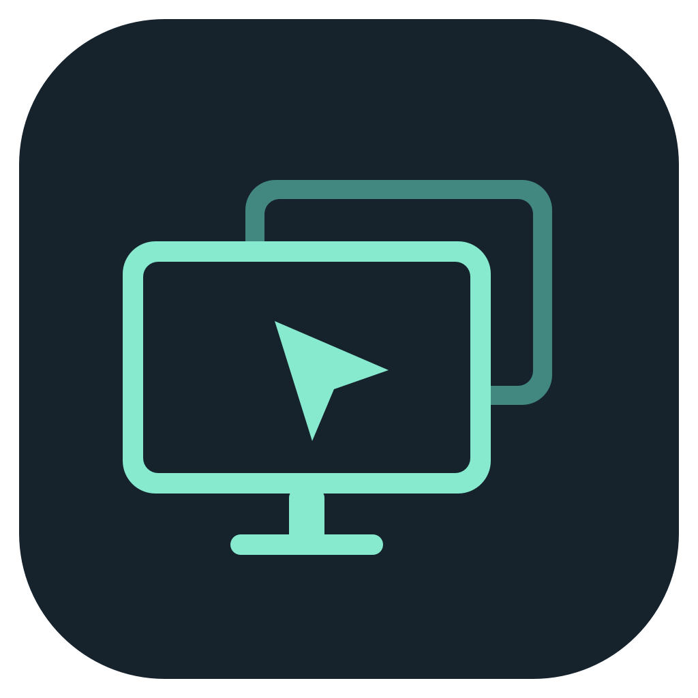

<a id="english"></a>

<p align="center"></p>

# ScreenPilot · 屏幕管家

[](#english)
[](#中文)

[](https://github.com/QiushanHuang/ScreenPilot/releases)
[](https://github.com/QiushanHuang/ScreenPilot/releases/latest)
[](https://github.com/QiushanHuang/ScreenPilot/releases/latest)
[](https://github.com/QiushanHuang/ScreenPilot/releases/latest)

**One desk. Several screens. A simpler way to switch, focus and recover.**
ScreenPilot brings per-screen brightness, output presets and compatible Mac/Windows input switching into one native Mac control center, with an optional Windows companion. Keep the screens you need active, give unused displays a chance to sleep, and bring your workspace back from the menu bar.

## Why ScreenPilot exists

A black picture is not necessarily a powered-down display. On an LCD, a black wallpaper or software overlay can leave the backlight running: the screen still glows in a dark room and continues consuming power. Meanwhile, a desk with several monitors and two computers can mean repeated trips through monitor input menus, brightness controls and macOS display settings.

ScreenPilot brings those everyday actions together. Choose **blackout** when you want to keep the desktop layout, or **stop Mac output** when you want to remove an unused desktop and let a compatible monitor enter its no-signal standby state. Standby and energy savings depend on the display and any other active input; ScreenPilot does not claim measured power savings.

## Where it helps

| At your desk | With ScreenPilot |
| --- | --- |
| You finish working across three screens and only need the laptop | Use **built-in screen only**, or run a saved output preset instead of disconnecting each cable |
| An unused LCD lights up the room even with a black picture | Stop its Mac output so a compatible monitor can enter standby; use software blackout when keeping the layout matters more |
| You work on a Mac and switch to a Windows PC on the same monitor | With a verified monitor mapping and LAN pairing, coordinate input switching from the apps instead of repeatedly reaching for the monitor's buttons |
| A USB switch moves your keyboard and mouse between computers | After setup, USB arrival can trigger the paired display-input workflow, reducing a separate manual input-selection step |
| You alternate between a full workspace and an evening reading setup | Save output combinations and brightness/blackout scenes, then apply the setup you need |
| You want to try a different screen configuration without losing your way back | Start with timed recovery; use per-screen reconnect or **restore all** from the menu bar or `⌃⌥⌘ R` |

## What makes it different

- **Coordinates the desk as a whole.** Brightness, active Mac outputs and a configured Windows companion live in one workflow. The companion can request input changes from the Windows side, useful when a monitor no longer accepts commands from its inactive Mac input. Compatibility still depends on the monitor.
- **Makes “dark” and “disconnected” separate choices.** Software blackout preserves the desktop; stopping output can let an unused LCD sleep. The controls make that tradeoff visible, instead of treating every black screen as power-off.
- **Makes recurring setups quick to use and recover.** Named presets, a built-in-screen shortcut, timed restoration and an independent recovery helper reduce repeated setup work. At least one Mac screen stays active; recovery attempts report failures rather than assuming success.

**Hardware brightness** uses native/DDC controls where supported; **software dimming** remains available as a clearly labeled visual fallback. Everything runs without an account or analytics. Pairing and startup are opt-in.

**Shared-host setup:** public builds include no personal monitor mapping. Mac/Windows host controls and USB automation require a locally verified mapping, a rebuild and LAN pairing; see [hardware setup](docs/hardware-setup.md). This coordinates existing video connections and a physical USB switch—it does not carry video or keyboard/mouse data between computers.

The application interface is currently **Simplified Chinese**. This README provides English and Chinese instructions; the language badges jump within this page.

## Download and install

Get **v1.6.3** from [Releases](https://github.com/QiushanHuang/ScreenPilot/releases/latest).

| Download | For |
| --- | --- |
| `ScreenPilot-1.6.3-macOS-arm64.dmg` | Apple Silicon Mac, macOS 14 or later; drag the app into Applications |
| `ScreenPilot-1.6.3-macOS-arm64.zip` | The same Mac app in a ZIP archive |
| `ScreenPilot-1.6.3-Windows.zip` | Ready-to-run Windows companion, Windows 10/11 with .NET Framework 4.8 |
| `ScreenPilot-1.6.3-WindowsBridge-source.zip` | Windows source, build launcher and troubleshooting scripts |
| `SHA256SUMS.txt` | SHA-256 checksums for the downloadable packages |

The Mac app is **ad-hoc signed, without Apple notarization or a Developer ID signature**.
The Windows executable is **not Authenticode signed**. If your OS blocks launch, review the download source and checksum first; on macOS use **System Settings → Privacy & Security → Open Anyway** if offered. Managed computers may require administrator approval. Do not disable system protections globally.

**Mac:** open the DMG, drag **屏幕管家.app** into Applications, eject the image, then launch the installed app. Closing the window keeps the menu-bar controls available; **Quit** ends the app and attempts to restore its stopped outputs and overlays.

**Windows:** extract the entire ZIP, run `ScreenPilotBridge.exe`, and choose the shared monitor. Use **安装到本机并创建桌面入口** to install for the current user. Startup is opt-in through **设置开机启动**. Close minimizes to the tray; use the tray's **退出** to exit. No compiler is needed for the ready-to-run ZIP.

## Start here

1. Open **显示器** and click **识别屏幕** to match cards with physical screens. Give identical monitors distinct names.
2. Adjust brightness on one card. Software dimming changes the visible image, not the physical backlight or its power use.
3. Try **黑屏** for a 12-second preview; confirm to keep it. Click the black area to recover.
4. For output disconnection, first choose **设置与诊断 → 通用 → 停止输出后的恢复 → 15 秒后恢复**. Stop one output and check both the screen and its restoration before saving a persistent setup.
5. In **预设**, create a named group and choose timed or manual recovery. Saving does not execute it. Brightness/blackout scenes are separate and never switch input or power.

**Recovery: `Control + Option + Command + R` (`⌃⌥⌘ R`).**
The sidebar and menu bar also offer **恢复所有屏幕**. This removes software dimming/blackout and requests reconnection of outputs stopped by ScreenPilot. It cannot guarantee a wake from hardware power-off or switch back a monitor that no longer accepts DDC commands. Keep the physical monitor controls accessible during initial setup.

## Three different ways to darken a screen

| Control | Desktop layout | Backlight | Recovery |
| --- | --- | --- | --- |
| Software dimming / blackout | Preserved | Remains on | Slider, click blackout, restore-all |
| Stop Mac output | May rearrange desktops | Depends on the monitor and other active inputs | Timed recovery, reconnect, restore-all |
| DDC hardware sleep | Hardware-dependent | Hardware-dependent | DDC wake only if the monitor still accepts it; physical controls may be needed |

Stopping Mac output does not turn off a Windows signal attached to the same display. The recovery helper attempts to restore connections and the recorded display layout; it does not promise that every third-party application window returns to the exact same pixel position. Failed recovery records remain available for retry.

## Mac ↔ Windows setup

The current companion assumes **Mac on HDMI 1 / Windows on HDMI 2**. This is monitor control, not video streaming or a software KVM.

1. Verify each cable/input and enable **DDC/CI** in the monitor's on-screen menu. First test the Windows local input buttons manually.
2. On Windows, select its LAN adapter/address, the Mac's LAN IPv4 address, and the shared monitor. Copy the generated **SP1** pairing code.
3. On Mac, open **设置与诊断 → USB 与配对**, paste the code, and test the connection. Keep the code private: it contains the pairing secret.
4. **Mac shared-host controls require an exact verified monitor mapping. Public builds ship with an empty mapping, so these controls and USB host switching are not enabled out of the box.** Follow [hardware setup](docs/hardware-setup.md) to configure and rebuild for your tested monitor. General display controls remain available according to detected capabilities.
5. With pairing and the mapping ready, select the actual shared USB interfaces on **both** hosts, then enable arrival automation. Confirm that the selected interfaces disappear/reappear when operating your USB switch.

Current USB automation uses the **paired LAN connection**. It does not switch on unplug or initial startup, uses about one second of settling and a five-second cooldown, and keeps the Mac layout during automatic switching. A wireless receiver staying connected may not produce an arrival when its keyboard wakes. Only connection metadata is inspected, not keystrokes or mouse movement.

Manual switching offers **保持 Mac 布局** or **移出 Mac 桌面**. The latter requires reconnection before switching back and may behave differently across monitors. The Windows local buttons work independently of pairing; this does not imply offline USB automation works.

## Compatibility and troubleshooting

- **Mac:** Apple Silicon only for the published binary; macOS 14+ deployment target. Private CoreDisplay/DDC interfaces may require changes after OS updates. Minimum deployment target is not proof of testing on every macOS version.
- **External displays:** DDC support depends on the monitor, active input, cable, dock and adapter. Unsupported or ambiguous devices do not gain hardware controls by assumption. Some model-specific unsafe power paths are disabled.
- **Blank/noisy screen:** stop automation, try restore-all, then use physical input selection or reconnect the display cable if necessary. A “command sent” result is not proof that the monitor changed input.
- **No shared-host buttons:** the public build has no personal monitor allowlist. See [hardware setup](docs/hardware-setup.md).
- **Pairing fails:** verify both LAN addresses, selected adapter, bridge process and OS firewall policy. Re-pair after an address/configuration change. Do not publish pairing codes.
- **Diagnostics:** use **设置与诊断 → 诊断** on Mac or `Network-Diagnostics.cmd` on Windows. These are read-only network checks; an explicitly requested connectivity check may contact Apple. Inspect device identifiers and network addresses before sharing reports.
- **Updates:** restore screens and quit the old app/Windows tray process before replacing the app files. Saved settings are retained. Do not run multiple tools that control the same monitor simultaneously during diagnosis.

This release is build/test validated. Windows GUI behavior, real cross-host switching and physical display power/recovery still require validation on your own hardware; automated tests are not hardware certification.

## Data and removal

| Data | Location |
| --- | --- |
| Mac names, scenes, presets and settings | User preferences domain `studio.qiushan.ScreenPilot` |
| Mac recovery records / logs | `~/Library/Application Support/ScreenPilot/Recovery` and `Logs` |
| Mac pairing secret | macOS Keychain, service `studio.qiushan.ScreenPilot.WindowsBridge` |
| Windows configuration / logs | `%APPDATA%\ScreenPilotBridge` |
| Windows installed app | `%LOCALAPPDATA%\ScreenPilotBridge` |

Windows protects saved secrets with DPAPI. Paired LAN requests and responses are authenticated and replay-checked; this is not a cloud service. No analytics are included. To uninstall, restore screens and quit, disable Windows startup if enabled, and remove the application. Settings and recovery records are deliberately retained; back them up before manually removing them. Remove the Mac pairing entry through Keychain Access if you want to erase pairing credentials.

## Build and contribute

Requires an Apple Silicon Mac with Xcode command-line tools, **Swift 6+**, and Python 3. Windows cross-builds additionally need the **.NET 8 SDK**; the resulting companion targets **.NET Framework 4.8**.

```sh
git clone https://github.com/QiushanHuang/ScreenPilot.git
cd ScreenPilot
swift test -c release
./scripts/build-app.sh
open dist/屏幕管家.app
```

Build Windows and its download packages before building Mac if you want the embedded Windows source package to also contain the executable:

```sh
dotnet build WindowsBridge/ScreenPilotBridge.csproj -c Release
python3 scripts/package-windows-ready.py
python3 scripts/package-windows-bridge.py
python3 -m unittest discover -s Tests -p 'test_*.py'
```

On Windows, the source bundle also includes `Build-and-Run.cmd`. See [contributing and validation](CONTRIBUTING.md), [release notes](docs/releases/v1.6.3.md), and [branding](docs/branding.md).

Created and maintained by **[QiushanHuang · Qiushan](https://github.com/QiushanHuang)**.
See [contributors](CONTRIBUTORS.md). Original code and artwork are currently **all rights reserved**, not MIT-licensed; see [LICENSE](LICENSE). Device discovery incorporates [m1ddc](https://github.com/waydabber/m1ddc) at commit `04d949794102eb8df01ad3681afff6464a3eede2`, under its [MIT license](Vendor/m1ddc/LICENSE). Upstream attribution is preserved.

---

<a id="中文"></a>

## 中文

[](#english)
[](#中文)

**一张桌面，多块屏幕。切换更顺手，专注更简单，恢复有入口。**
屏幕管家把逐屏亮度、关屏预设和兼容设备的 Mac/Windows 输入切换，集中到一个 Mac 原生控制中心，并提供可选的 Windows 配套程序。让需要的屏幕继续工作，让闲置屏幕有机会进入休眠，再从菜单栏找回工作空间。

### 为什么需要屏幕管家

**画面变黑，不代表显示器已经关闭。** LCD 显示器即使显示纯黑壁纸或被软件黑色遮罩覆盖，背光仍可能亮着：暗处看得见泛光，也仍在耗电。而当桌上有几块显示器、两台电脑时，切换输入源、逐屏调亮度、调整 Mac 桌面，往往又要分别操作显示器菜单和系统设置。

屏幕管家把这些日常操作放在一起：想暂时不看某块屏幕、保留窗口布局，就用**软件黑屏**；想停用闲置桌面，让兼容显示器在无信号后进入待机，就用**停止 Mac 输出**。是否真正待机、能节省多少电，取决于显示器及其他输入是否仍有信号；本项目没有宣称实测节电比例。

### 哪些场景更方便

| 你的使用场景 | 屏幕管家怎么帮你 |
| --- | --- |
| 白天三屏办公，晚上只想用笔记本 | 点击“仅用内置屏”，或执行保存的关屏预设，减少逐根拔线的操作 |
| 闲置 LCD 已经是黑色画面，晚上却依旧泛光 | 停止其 Mac 输出，让兼容显示器进入无信号待机；更看重保留布局时，则使用软件黑屏 |
| Mac 处理工作，Windows 运行另一套应用，共用一块显示器 | 配置实测映射和局域网配对后，通过应用协调输入切换，减少反复摸索显示器实体按键 |
| 用 USB 切换器在两台电脑间共用键盘、鼠标 | 配置后，键鼠接入可触发配对的显示器切源流程，减少再手动选择一次输入源的步骤 |
| 经常在完整工作台与夜间阅读之间切换 | 保存常用关屏组合，以及亮度/黑屏场景，需要时直接应用 |
| 想尝试新的屏幕组合，又担心找不回桌面 | 先用倒计时恢复；也可单屏重连，通过菜单栏或 `⌃⌥⌘ R` 恢复全部 |

### 它的优势在哪里

- **把整张桌面的设备协调起来。** 逐屏亮度、Mac 活动输出和配置后的 Windows 配套程序组成连续操作流程。配套程序可以从 Windows 一侧请求切源，适用于部分显示器不再接受非当前 Mac 输入命令的情况；具体效果仍取决于显示器兼容性。
- **分清“画面黑了”和“输出停了”。** 软件黑屏保留桌面，停止输出则可能让闲置 LCD 进入待机。你可以根据布局、光线和节能需求选择操作，不会把所有黑色画面都误当成关机。
- **常用组合少点几次，恢复路径随时可见。** 命名预设、仅用内置屏、定时恢复和独立恢复程序，减少重复设置。操作会保留至少一块 Mac 活动屏幕；恢复失败会明确提示，而不是默认成功。

支持的设备可使用**原生/DDC 硬件亮度**，不支持时提供明确标注的**软件调暗**。无需账户，无分析遥测；配对与开机启动由你主动设置。

**跨主机配置要求：** 公开包不包含个人显示器映射。Mac/Windows 主机按钮和 USB 自动切换需要本地实测映射、重新构建及局域网配对，见[硬件配置说明](docs/hardware-setup.md)。它协调已有视频连线与实体 USB 切换器，不负责在电脑之间传输视频或键鼠数据。

软件界面目前为**简体中文**。本页提供完整中英说明；点击语言徽标直接跳到当前 README 对应位置，不打开另一份 Markdown。

### 下载与安装

从 [Releases](https://github.com/QiushanHuang/ScreenPilot/releases/latest) 下载 **v1.6.3**。

| 文件 | 用途 |
| --- | --- |
| `ScreenPilot-1.6.3-macOS-arm64.dmg` | Apple Silicon Mac，macOS 14+；拖入 Applications 安装 |
| `ScreenPilot-1.6.3-macOS-arm64.zip` | 相同 Mac 应用的 ZIP 包 |
| `ScreenPilot-1.6.3-Windows.zip` | Windows 10/11 即用程序，需要 .NET Framework 4.8 |
| `ScreenPilot-1.6.3-WindowsBridge-source.zip` | Windows 源码、构建启动器及诊断脚本 |
| `SHA256SUMS.txt` | 下载文件的 SHA-256 校验值 |

Mac 版本为 **ad-hoc 签名，未使用 Developer ID 签名、未经过 Apple 公证**；Windows 程序**未使用 Authenticode 签名**。系统阻止启动时，先确认下载来源和校验值；macOS 可在提供该选项时使用**系统设置 → 隐私与安全性 → 仍要打开**。受管理电脑可能需要管理员许可，不必全局关闭系统保护。

**Mac：**打开 DMG，将**屏幕管家.app** 拖入 Applications，推出磁盘映像后启动应用。关闭窗口仍保留菜单栏控制；退出应用会尝试恢复遮罩和已停止的输出。

**Windows：**完整解压，双击 `ScreenPilotBridge.exe`，选择共享显示器。点击**安装到本机并创建桌面入口**完成当前用户安装；**设置开机启动**为主动选择。关闭窗口收起到托盘，托盘**退出**才完全结束。即用包不需要编译器。

### 快速开始

1. 在**显示器**页点击**识别屏幕**，对应实体屏幕；为同名设备分别命名。
2. 从单块屏幕开始调整亮度。软件调暗只改变画面，不降低真实背光与其功耗。
3. 点击**黑屏**先预览 12 秒，确认后保持。点击黑屏区域即可恢复。
4. 测试停止输出前，先在**设置与诊断 → 通用 → 停止输出后的恢复**选择**15 秒后恢复**。逐屏确认关闭与恢复后，再使用持续关闭。
5. 在**预设**中保存关屏组合及定时/手动恢复方式，保存不会立即执行。亮度与黑屏场景单独保存，不切换输入或硬件电源。

**紧急恢复：`Control + Option + Command + R`，即 `⌃⌥⌘ R`。**
侧栏和菜单栏均有**恢复所有屏幕**，用于清除软件调暗/黑屏，并请求恢复本应用停止的输出。它不保证能唤醒硬件断电的显示器，也不能保证把不再接受 DDC 的屏幕切回；首次配置时请保留使用实体按键的条件。

### 三种关屏方式的区别

| 操作 | 桌面布局 | 背光 | 恢复 |
| --- | --- | --- | --- |
| 软件调暗 / 黑屏 | 保持 | 仍亮着 | 滑块、点击黑屏、恢复全部 |
| 停止 Mac 输出 | 可能重新排列 | 取决于显示器及其他输入 | 倒计时、单屏重连、恢复全部 |
| DDC 硬件休眠 | 取决于硬件 | 取决于硬件 | 仍接受命令才可 DDC 唤醒，否则需实体操作 |

停止 Mac 输出不等于关闭同屏上的 Windows 信号。独立恢复程序尝试恢复连接及保存的屏幕布局，不保证每个第三方应用窗口都回到原来的像素位置。恢复失败记录会保留，以便重试。

### Mac ↔ Windows 配置

当前配套程序约定 **Mac 接 HDMI 1、Windows 接 HDMI 2**。功能是显示器控制，不传输视频，也不是软件 KVM。

1. 检查线缆与输入口，在显示器菜单开启 **DDC/CI**；先手动测试 Windows 本地切源按钮。
2. Windows 端选择局域网网卡/地址、Mac 的局域网 IPv4 和共享显示器，复制 **SP1** 配对码。
3. Mac 进入**设置与诊断 → USB 与配对**，粘贴配对码并测试连接。配对码含密钥，不要公开。
4. **Mac 跨主机按钮依赖精确验证的显示器映射。公开发行包使用空映射，因此这些按钮和 USB 主机切换并非开箱即用。**请按[硬件配置说明](docs/hardware-setup.md)为已实测屏幕配置并重新构建；常规屏幕控制按检测到的能力提供。
5. 配对和映射完成后，在**两端分别**选择真实共享 USB 接口，再开启接入自动切换。先操作 USB 切换器，确认所选接口确实消失/出现。

当前 USB 自动切换使用**已配对局域网**，不会在拔出或初次启动时切屏，约 1 秒防抖、5 秒冷却；自动切换保持 Mac 布局。无线接收器一直连接时，键盘唤醒不一定产生接入事件。程序只检查连接元数据，不读取按键或鼠标移动。

手动切换可选择**保持 Mac 布局**或**移出 Mac 桌面**，后者切回时需要重连，兼容性取决于设备。Windows 本地按钮不依赖配对，但这不代表离线 USB 自动切换可用。

### 兼容性与排查

- **Mac：**发布二进制仅支持 Apple Silicon，部署目标 macOS 14+；使用私有 CoreDisplay/DDC 接口，系统更新后可能需要适配。最低部署版本不代表每个系统版本都经过实机验证。
- **外屏：**DDC 能力与显示器、当前输入、线缆、扩展坞和转接器有关。身份模糊或不支持的设备不会被假定支持硬件操作；部分型号的不安全电源路径已禁用。
- **黑屏/雪花：**先停止自动切换、尝试恢复全部；必要时使用实体输入选择或重插显示器线缆。“命令已发送”不等于实体屏幕切换成功。
- **没有主机切换按钮：**公开构建不包含个人屏幕白名单，见[硬件配置](docs/hardware-setup.md)。
- **配对失败：**检查两端地址、所选网卡、Windows 进程和系统防火墙策略；地址/配置改变后重新配对。不要公开配对码。
- **诊断：**Mac 使用**设置与诊断 → 诊断**，Windows 运行 `Network-Diagnostics.cmd`。网络检查为只读；主动执行连通性检查时可能访问 Apple。分享报告前检查设备标识和网络地址。
- **更新：**恢复屏幕并退出旧版应用/Windows 托盘进程后替换文件，保存的设置保留。排查时避免多个工具同时控制同一显示器。

本发布经过构建与自动化测试。Windows 界面、真实跨主机切换、实体屏幕电源和恢复仍需在自己的硬件上验证；自动化测试不等于硬件认证。

### 数据与卸载

| 内容 | 位置 |
| --- | --- |
| Mac 名称、场景、预设与设置 | 用户偏好域 `studio.qiushan.ScreenPilot` |
| Mac 恢复记录 / 日志 | `~/Library/Application Support/ScreenPilot/Recovery` 与 `Logs` |
| Mac 配对密钥 | 钥匙串服务 `studio.qiushan.ScreenPilot.WindowsBridge` |
| Windows 配置 / 日志 | `%APPDATA%\ScreenPilotBridge` |
| Windows 安装位置 | `%LOCALAPPDATA%\ScreenPilotBridge` |

Windows 通过 DPAPI 保护保存的密钥。局域网请求/响应经过认证和防重放检查，无云端服务或分析遥测。卸载前先恢复屏幕、退出程序，Windows 若启用了开机启动请先取消，然后移除应用。设置和恢复记录默认保留，手动清除前请备份。需要清除 Mac 配对凭据时，可通过“钥匙串访问”移除对应条目。

### 构建与贡献

Mac 构建需要 Apple Silicon、Xcode 命令行工具、**Swift 6+** 和 Python 3。Windows 交叉构建另需 **.NET 8 SDK**，生成程序面向 **.NET Framework 4.8**。

```sh
git clone https://github.com/QiushanHuang/ScreenPilot.git
cd ScreenPilot
swift test -c release
./scripts/build-app.sh
open dist/屏幕管家.app
```

如需 Mac 内嵌的 Windows 源码包也包含可执行程序，先构建 Windows：

```sh
dotnet build WindowsBridge/ScreenPilotBridge.csproj -c Release
python3 scripts/package-windows-ready.py
python3 scripts/package-windows-bridge.py
python3 -m unittest discover -s Tests -p 'test_*.py'
```

Windows 源码包也提供 `Build-and-Run.cmd`。参见[贡献与验证](CONTRIBUTING.md)、[发布说明](docs/releases/v1.6.3.md)和 [Logo 设计](docs/branding.md)。

作者与维护者：**[QiushanHuang · Qiushan](https://github.com/QiushanHuang)**，详见[贡献者](CONTRIBUTORS.md)。项目原创代码和图形目前**保留所有权利**，并非 MIT 授权，见 [LICENSE](LICENSE)。设备发现使用 [m1ddc](https://github.com/waydabber/m1ddc) 固定提交 `04d949794102eb8df01ad3681afff6464a3eede2`，保留其作者署名及 [MIT 许可](Vendor/m1ddc/LICENSE)。
